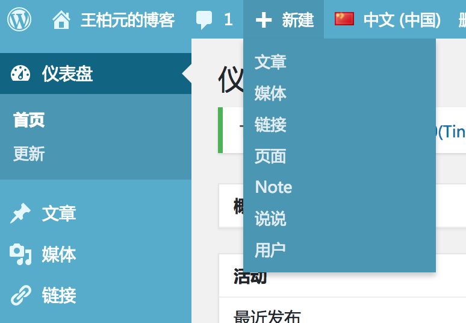

# WordPress 说说插件
This is a plugin to write short article in wordpress like QQ ShuoShuo. Wordpress的写说说、微语插件, 让wordpress不仅仅可以长篇大论，而可以微言大义。

## 1. Context

wordpress是最受欢迎的博客程序之一，但是却没有其它有些博客CMS程序的“微语”这样的功能。有时候我们只想用一两句话抒发一下自己的情绪，就想用wordpress发个微博，发个说说；没有必要写成长篇大论，如果凑字数就完全失去了“抒发”的真谛。

## 2. Set Up
 - 2.1 下载插件包
  [下载地址](https://github.com/geekeren/WordPressShuoShuo/releases)
 - 2.2 在Wordpress后台安装插件包
 
## 3. Usage
 - 3.1 新建说说
  
 - 3.2 查看说说
   - 说说列表路径：http://wangbaiyuan.cn/shuoshuo ({home_url}/shuoshuo)
   - 单条说说：http://wangbaiyuan.cn/shuoshuo ({home_url}/shuoshuo/???)
## 4.API
 在Wordpress 4.7以上，Wordpress说说插件支持Rest API支持，方便开发者使用本插件进行二次开发。比如你可以在此插件的基础上开发Android/IOS APP或者SPA。[王柏元的博客客户端](https://github.com/geekeren/BYBolg-open)就是基于此开发的。˚
 
 - 4.1 获取说说列表
 
    `GET http://wangbaiyuan.cn/wp-json/wp/v2/shuoshuo`
 - 4.2 发表说说   
 
    `POST http://wangbaiyuan.cn/wp-json/wp/v2/shuoshuo`
 >发表说说操作会需要认证，详细的更多资料请参考Wordpress官方文档：[https://developer.wordpress.org/rest-api/](https://developer.wordpress.org/rest-api/)
 
## 4. 预览

[http://wangbaiyuan.cn/shuoshuo](http://wangbaiyuan.cn/shuoshuo)

## 关注与交流

<h4>加我的微信，获取最近更新<h4>
 

